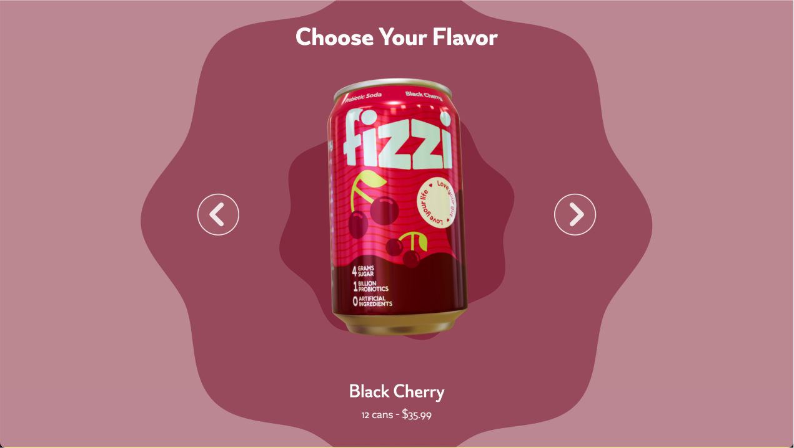

# Creative 3D Website

This is a visually engaging, animation-rich portfolio website built with modern web technologies. The main purpose of the site is to **impress potential clients** with sleek, interactive 3D scenes and fluid animations that showcase creativity and technical skill.

- **Demo**: [Open live demo][live-demo]
- **Learn more about Prismic and Next.js**: [Prismic Next.js Documentation][prismic-docs]



## Tech Stack

- **Next.js** — for server-side rendering and optimized React performance.
- **TypeScript** — for static typing and better development experience.
- **Tailwind CSS** — for rapid UI styling with utility-first CSS.
- **Prismic.io** — as a headless CMS for flexible and dynamic content management.
- **Three.js** — for rendering advanced, real-time 3D scenes in the browser.
- **GSAP** — for smooth and performant animations.

## Features

- Multiple **custom-built 3D scenes** integrated into the UI.
- **Scroll-triggered animations** using GSAP and Three.js.
- Fully **responsive** and mobile-friendly design.
- **CMS-powered content** through Prismic, allowing for easy updates.
- Optimized performance and SEO benefits via Next.js.

## Getting Started

1. **Clone the repository:**

   ```bash
   git clone https://github.com/AslanovRustam/aslan-can.git

   cd aslan-can

   npm i

   npm run dev
   ```

   Open http://localhost:3000 in your browser to see the result.

[prismic]: https://prismic.io/
[prismic-docs]: https://prismic.io/docs/technologies/nextjs
[prismic-sign-up]: https://prismic.io/dashboard/signup
[nextjs]: https://nextjs.org/
[live-demo]: https://aslan-can.vercel.app/
